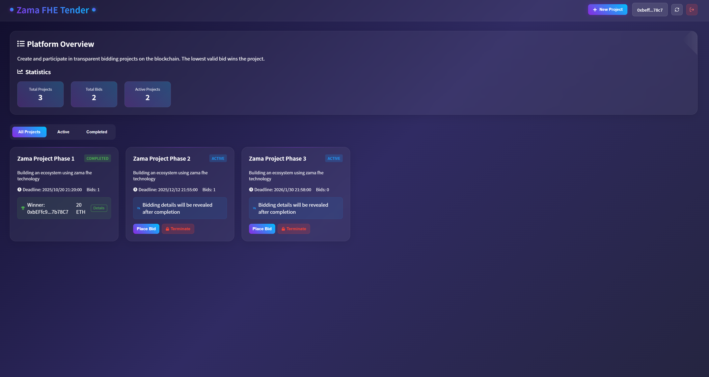

# TenderFlow – Decentralized Tender & Bidding Platform

A simple on-chain application that allows users to create tender projects, submit bids (as numbers, not locked funds), and automatically reveal the winner when the project ends.

---

## 🌐 Live Demo
Try the live application: https://zama-fhe-survey.vercel.app/



---

## 🏛️ Background

Decentralized applications make it possible to run open and verifiable processes without intermediaries.  
This project explores how smart contracts can be used to support a transparent tender / bidding workflow.

---

## ✨ Features

- Create projects with title, description, and deadline  
- Submit bids expressed in ETH units (recorded on-chain, no actual transfer)  
- View basic statistics for each project  
- Terminate a project and automatically declare the lowest bid as the winner  

---

## 🏗 Architecture

### Smart Contract

- `Tendering.sol` – core contract that stores projects, bids, and winner logic.

### Frontend (optional)

- Displays projects and their details  
- Lets users place bids and view results  
- Integrates with a wallet (e.g., MetaMask)

---

## 🧰 Tech Stack

| Component | Technology |
|-----------|------------|
| Smart Contract | Solidity ^0.8.24 |
| Blockchain Interaction | Ethers.js |
| Frontend | React + TypeScript |
| Styling | Tailwind / CSS Modules |
| Dev Tools | Hardhat or Foundry |

---

## 🚀 Installation & Usage

### Prerequisites

- Node.js (16+ recommended)  
- npm or yarn  
- Wallet extension (MetaMask)  
- Local or test Ethereum network (Hardhat, Sepolia, etc.)

### Steps

```bash
# Clone repository
git clone <your-repo-url>
cd <repo-directory>

# Install dependencies
npm install

# Compile the contract
npx hardhat compile

# Deploy (replace <network> with your target network)
npx hardhat run scripts/deploy.js --network <network>

# Start the frontend
cd frontend
npm run dev
```

## 📜 Contract Interface

| Function | Access | Description |
|----------|--------|-------------|
| `createProject(title, description, deadline)` | Anyone | Creates a project |
| `placeBid(projectId, amountETH)` | Anyone | Stores a bid (number only) |
| `terminateProject(projectId)` | Project creator | Ends project and declares winner |
| `getProjectStats(projectId)` | Anyone | Returns participants, average, highest & lowest bids |
| `getWinner(projectId)` | Anyone | Returns winner and lowest bid after termination |

---

## ⚠️ Notes & Limitations

- Bids are stored as numbers — no escrow or fund transfer is involved.  
- There’s no penalty or reward mechanism for participants.  
- If no bids are placed, winner is `address(0)` and amount is `0`.  

---

## 🌱 Future Improvements

- Add deposit / escrow for bids  
- Allow bid withdrawal or refunds  
- Support decimal bids with proper precision  
- Enrich UI with charts, filters, and countdown timers  

---

## 📂 Project Structure

/.
├── contracts/
│ └── Tendering.sol
├── frontend/
│ ├── App.tsx
│ ├── components/
│ ├── contract/
│ └── styles/
├── scripts/
├── test/
├── hardhat.config.js
└── README.md

---

## 🙌 Acknowledgements

Inspired by open-source smart contract demos and community tutorials.  
Thanks to contributors and testers who helped improve this project.
